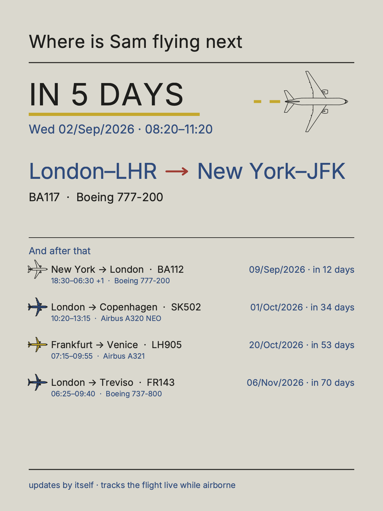

# flightframe

A cloud service that puts the flights you are actually taking on a
six-colour e-ink frame. Schedules come from a flight-data API, live
positions from [adsb.lol](https://adsb.lol) and routes from
[adsbdb](https://adsbdb.com); the server renders 1200×1600 posters, and a
battery-powered ESP32 frame wakes every few minutes, downloads the latest
one, and goes back to sleep.

| | | |
|:---:|:---:|:---:|
|  |  |  |
| **Flying next** — a travel board, countdown and all, for a frame in someone else's house | **Tracked flight** — the one in the air right now, followed to the gate | **Low battery** — a dying frame explains itself |

Multi-tenant: each household gets an isolated dashboard (location, refresh
cadence, awake window, timezone, flight list) behind an invite-only login. The travel board speaks the tenant's language, fills
itself from a flight number (route, cities, times, aircraft, terminal,
delays), follows red-eyes across midnight, and hands the glass over to live
tracking while the flight is in the air.

## Layout

    flightframe/       server: renderers, web dashboard, device API
    tools/provision/   one-time BLE provisioning of a frame (Wi-Fi + server)
    tools/simulate_frame.py   protocol conformance check, no hardware needed
    caddy/             TLS termination for cloud deployment
    tests/             offline test suite

## Run (development)

    python3 -m venv .venv && .venv/bin/pip install pillow cairosvg bleak
    cp .env.example .env
    .venv/bin/python -m flightframe.cli tenant add t1 --name You \
        --lat 51.5154 --lon -0.1410 --label "Oxford Circus"
    .venv/bin/python -m flightframe.cli user add t1 you@example.com
    .venv/bin/python -m flightframe.cli serve --host 127.0.0.1

Then in another terminal:

    .venv/bin/python -m flightframe.cli run-renderer --loop 180

## Run (production)

    docker compose --profile cloud up -d --build

See `caddy/Caddyfile` for the hostname, and `deploy.sh` for updates.

## Tests

    .venv/bin/python -m unittest discover tests

Everything runs offline; the suite includes multi-tenant isolation tests
over live HTTP and a device-protocol simulator.

## Licence

Server code © Mattia Borsoi. The BLE provisioning tool vendors Espressif's
`esp_prov` modules under Apache-2.0 (see `tools/provision/vendor/`).
The sample posters above are renders of synthetic data over the repo's
placeholder location.
